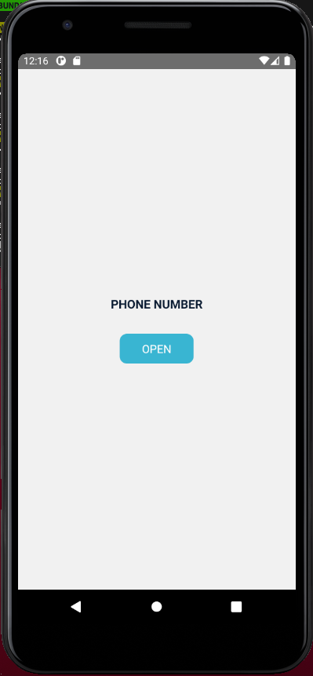

# ContactBook-column

This project is simple ContactBook built by React Native.

## Requirements

1. Display a button to open contact book on screen.
2. On clicking the button, open the list of contacts in user's phone.
3. On contact list, each contact item should display the contact's profile picture, full name and the number/type of number(Home/work)
4. Once the user selects a contact, close the contacts list and display the chosen contact's phone number in a text field(not as an alert/toast).
5. If a contact has multiple phone numbers, you can make the choice of any number
6. Testing using Jest

## Preview




## Main technologies used

- [React Native](https://github.com/facebook/react-native)

> A framework for building native apps with React.

- [React Navigation](https://github.com/react-navigation/react-navigation)

> Routing and navigation for your React Native apps

## Running the project

- Clone this project

```
git clone https://github.com/devHybrid0306/ContactBook-column.git
```

- Install NPM

```
npm install
```

- Connect to Android device or run Android emulator, and run this command

```
npx react-native run-android
```

## Testing

Run example app tests with:

```
npm test
```
